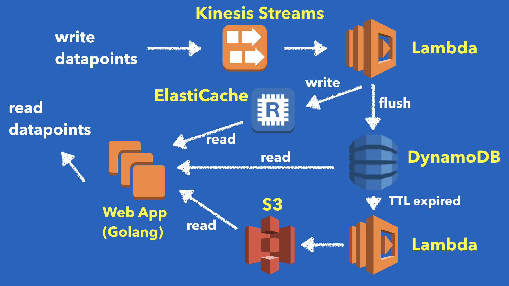

DiamonDB: the rebuild of time series database on AWS
====================================================

[](https://travis-ci.org/yuuki/diamondb)
[](https://goreportcard.com/report/github.com/yuuki/diamondb)
[](https://opensource.org/licenses/Apache-2.0)

This software is still heavily under development.

## What is DiamonDB?

DiamonDB is a reliable, scalable, cloud-based time series database.

- __Reliablity on top of well-known storage implementations__
- __Horizontal scalability__
- __Cost optimized__
- __Compatible with Graphite API__
- __Written in Go__

## Architecture



## Development

### Run server with Docker

```shell
make up
```

### Build

```shell
make
```

### Test

```shell
make test
```

## Publications

1. Yuuki Tsubouchi, Asato Wakisaka, Ken Hamada, Masayuki Matsuki, Hiroshi Abe, Ryosuke Matsumoto, “HeteroTSDB: An Extensible Time Series Database for Automatically Tiering on Heterogeneous Key-Value Stores”, The 43rd Annual IEEE International Computers, Software & Applications Conference (COMPSAC), pp. 264-269, July 2019. [[paper]](https://yuuk.io/papers/heterotsdb_compsac2019.pdf)

## Presentations

### English

1. [HeteroTSDB: An Extensible Time Series Database for Automatically Tiering on Heterogeneous Key-Value Stores](https://speakerdeck.com/yuukit/heterotsdb-an-extensible-time-series-database-for-automatically-tiering-on-heterogeneous-key-value-stores)

### Japanese

1. [サーバモニタリング向け時系列データベースの探究 / The study of time-series database for server monitoring](https://speakerdeck.com/yuukit/the-study-of-time-series-database-for-server-monitoring)
1. [高度に発達したシステムの異常は神の怒りと見分けがつかない / IPSJ-ONE 2017 y_uuki](https://speakerdeck.com/yuukit/ipsj-one-2017-y-uuki)
1. [時系列データベースという概念をクラウドの技で再構築する](https://speakerdeck.com/yuukit/the-rebuild-of-time-series-database-on-aws)

## Thanks

[astj](https://github.com/astj), [itchyny](https://github.com/itchyny), [haya14busa](https://github.com/haya14busa)

# LICENSE

Copyright 2017 TSUBOUCHI, Yuuki <yuki.tsubo@gmail.com>

Licensed under the Apache License, Version 2.0 (the "License"): you may not use this file except in compliance with the License. You may obtain a copy of the License at

http://www.apache.org/licenses/LICENSE-2.0
Unless required by applicable law or agreed to in writing, software distributed under the License is distributed on an "AS IS" BASIS, WITHOUT WARRANTIES OR CONDITIONS OF ANY KIND, either express or implied. See the License for the specific language governing permissions and limitations under the License.
